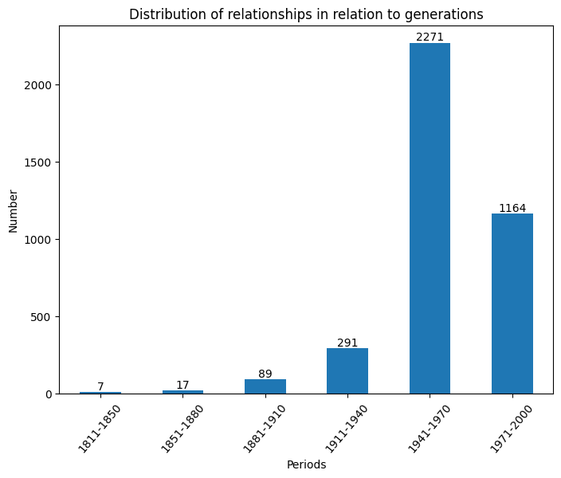
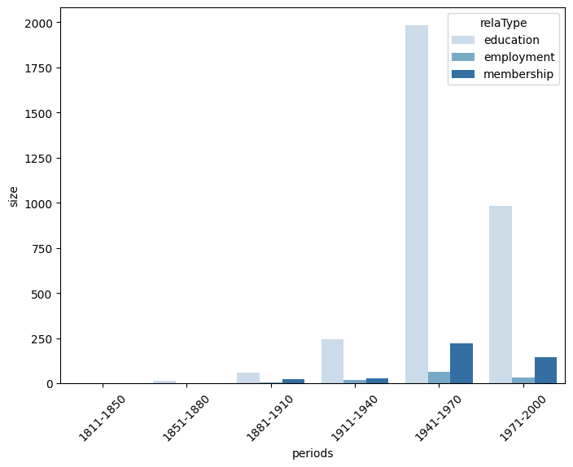

# Les réseaux de correspondance de nos CEOs

Le but de cette 3e questions était de savoir quelles connexions nos PDG avaient, puisqu'il n'est pas facile de faire le trajet jusqu'à ce poste tout(e) seul(e).
Dans le cas de cette analyse, nous allons plus nous concentrer sur les connexions des organisations, qui peuvent aussi jouer un rôle dans la formation de nos CEOs.

## Networks of organisations

A l'aide d'une fonction illustrant les relations, on a décidé de visualiser celles de 2 périodes, 1881-1910 et 1941-1970.

Malgré le fait qu'elles se situent à quelques décennies l'une de l'autre, on observe un changement drastique dans les réseaux de correspondance.

Et si on regarde à travers les générations, ce n'est vraiment, comme on vient de le voir, qu'à partir de 1941, durant WWII, que les réseaux de correspondance avec les organisations augmentent. On voit aussi dans le 4e graphique que les réseaux avec les organisations académiques ont bien plus d'impact que les 2 autres types de relations.

Cette analyse ayant ses limitations, on peut conclure hypothétiquement qu'en effet, les réseaux de correspondance et d'influence ainsi que l'appartenance à certains cercles structurent-ils et favorisent-ils l'accès aux postes de direction.
