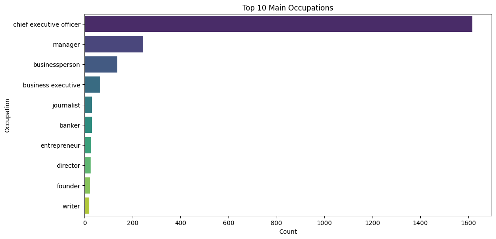

# Autres positions possibles de la population

## Occupation(s) principale(s)

A l'aide d'un barplot regroupant les principales occupation de notre populations, nous avons obtenu un aperçu de l'activité principale de nos CEOs.

On observe, à notre surprise, que le poste de CEO, même s'il posside l'effectif le plus grand, n'est pas l'occupation principale de tous nos PDG.

On remarque aussi que les 3 occupations suivantes se situent dans le domaine de la gestion et du business. Ce que nous pouvons en tirer, c'est que ces domaines facilitent l'acces à ce type de poste.
